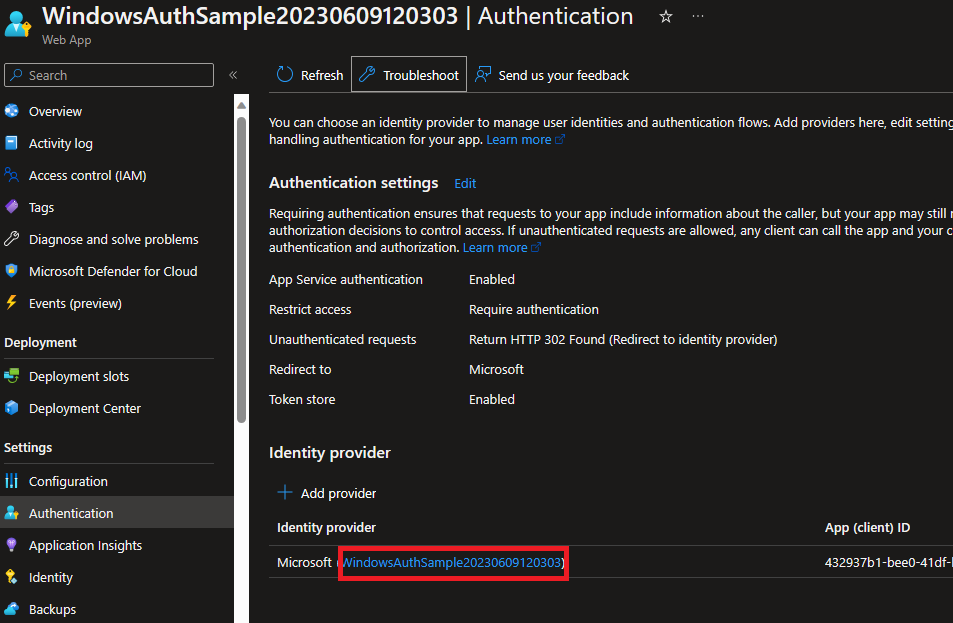
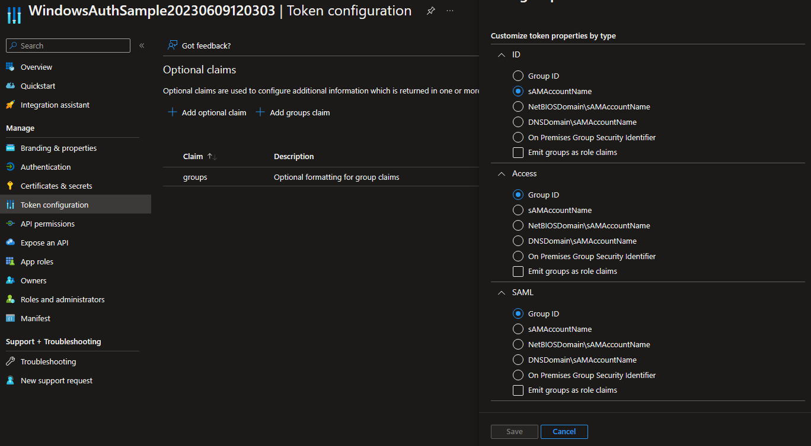
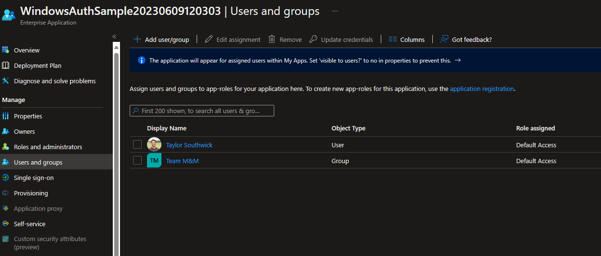

# EasyAuth extension for Authorization

[EasyAuth](https://learn.microsoft.com/en-us/azure/app-service/overview-authentication-authorization) in Azure is a great way to add initial authentication to an application when moving to Azure. For the cases it covers, it is a great way to get user authentication set up. However, it does not provide a way to authorize users.

## Scenario

The main driver of this example is a .NET Framework application that is using the Windows authentication in their `web.config` such as the following:

```xml
<configuration>
  <system.web>
    <authentication mode="Windows" />
    <authorization>
      <deny users="?" />
      <allow users="..." />
      <allow roles="..." />
    </authorization>
  </system.web>
</configuration>
```

With that simple statement, many applications were able to lock down access to only certain users or roles (i.e. security groups). When moving to Azure, the authentication piece can be replaced with EasyAuth, but there is no easy way to replace the authorization node.

Enter, this project.

This project contains a sample of a POC to enable authorization based on security groups (which could be extended to users). This uses group claims in AAD, which has some limitations; please refer to the [docs](https://learn.microsoft.com/azure/active-directory/develop/optional-claims) for the most current information.

## Try it out

Clone this repo, and do the following:

1. Open `WindowsAuthSample.sln` in Visual Studio
1. Open `web.config` and find the `configuration/easyAuth/allow` node and add the group you want to allow
1. Right click `WindowsAuthSample` and select publish. Deploy to Azure App Service
1. Enable EasyAuth with the following directions: https://learn.microsoft.com/en-us/azure/app-service/scenario-secure-app-authentication-app-service
1. From the WebApp, page go to Settings -> Authentication -> Identity provider and click the link to the app registration
  
1. Click the `Token Configuration` option and add a group claim, with the following settings:
  
1. Go to AAD and find the Enterprise Application for the App Registration.
1. Once there, go to `Users and groups` to add a group you care about:
  

Now